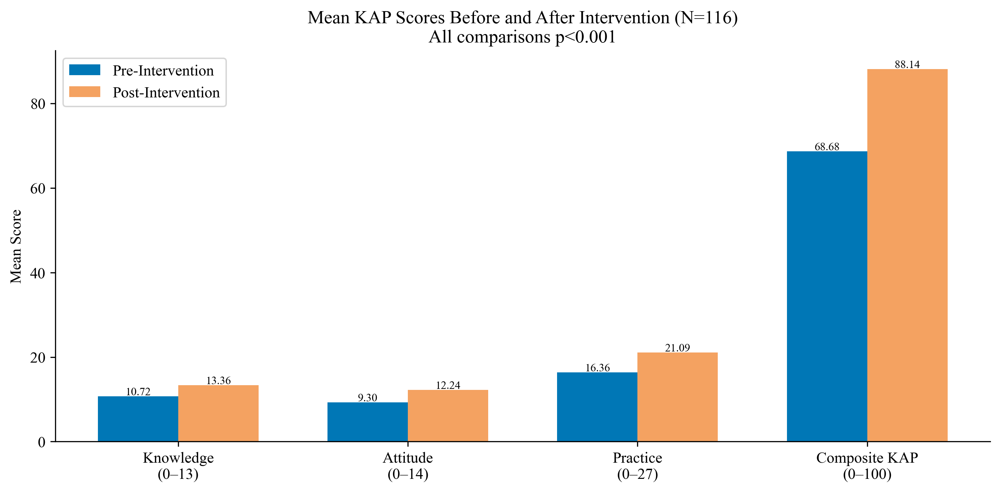
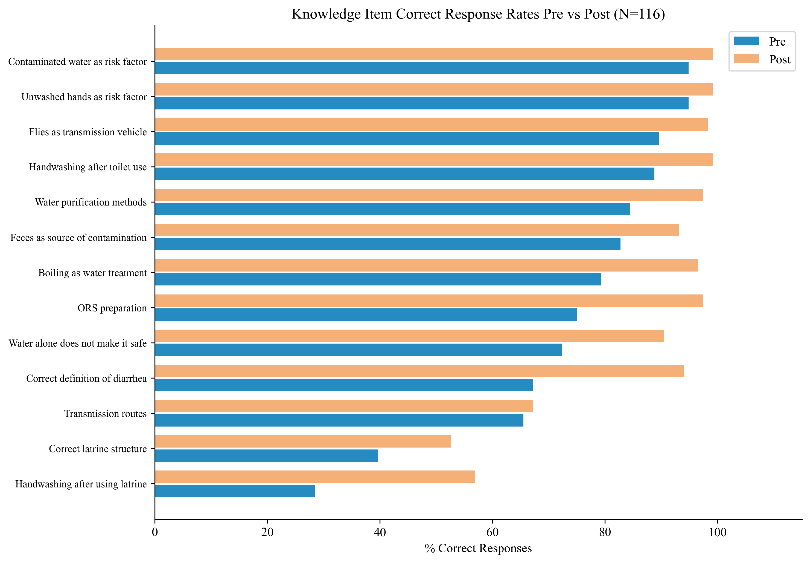
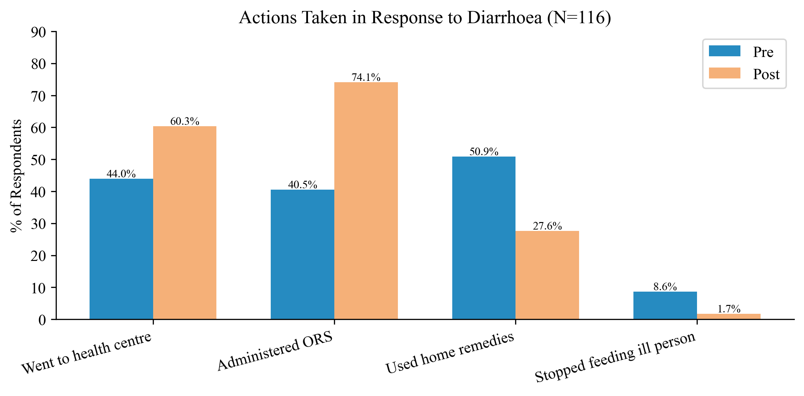

# Evaluation of a Diarrheal Prevention Program Among Internally Displaced Persons

## Marwi Camps, Sudan – 2025

**Study type:** Quasi-experimental (independent pre- and post-intervention cross-sectional design)

**Degree level:** MD (Clinical Medical Doctorate - Family Medicine)

**Institution:** Sudan Medical Specializations Board

**Sample size:** N = 116 per time point (pre-intervention and post-intervention)

**Data analyst:** Abdulrahman Sirelkhatim

---

## Background

Diarrhoeal disease is a leading cause of preventable morbidity and mortality in humanitarian settings,
disproportionately affecting displaced populations with limited access to safe water, sanitation, and hygiene
(WASH) services. In Sudan, the armed conflict that erupted in April 2023 displaced millions of civilians
into informal camps where WASH infrastructure is severely degraded.

Marwi Camps, located in Sudan, house a large population of internally displaced persons (IDPs). At
baseline, 42.2% of surveyed households reported at least one diarrhoeal episode in the preceding month —
a prevalence substantially higher than national averages. Community health education programs represent
a scalable, low-cost intervention for reducing diarrhoeal burden in such settings by improving knowledge,
shifting attitudes, and changing health-related practices.

This study evaluates the impact of a structured diarrheal prevention education program delivered to IDP
community members in Marwi Camps. By comparing KAP (Knowledge, Attitudes, Practices) profiles before
and after the intervention, the study provides evidence on the program's effectiveness and identifies
which domains showed the greatest gains.

## Objectives

- Assess baseline KAP levels regarding diarrhoeal disease prevention among IDP community members
- Evaluate changes in KAP scores following the educational intervention
- Compare household diarrhoea prevalence and treatment-seeking behaviour before and after the program
- Identify sociodemographic predictors of KAP at baseline and determine whether those predictors
  persist post-intervention

## Study Design & Methods

| Component | Detail |
|-----------|--------|
| Design | Quasi-experimental; independent cross-sectional samples at two time points |
| Setting | Marwi Displacement Camps, Sudan |
| Population | Adult IDP community members (≥18 years) resident in camp |
| Sampling | Simple random sampling at each time point |
| Sample size | N = 116 per wave |
| Data collection | Structured interviewer-administered questionnaire |
| Comparison method | One-sample t-tests (post means compared against pre means as reference) |

> **Design note:** Pre and post samples are independent, not matched pairs. A true paired design was
> not feasible given the displacement context. The one-sample t-test approach — comparing
> post-intervention means against the pre-intervention mean as a fixed reference value — is the
> appropriate statistical method for this quasi-experimental design.

**Technical suite:**

| Tool | Purpose |
|------|---------|
| Python (pandas, numpy) | Data cleaning, KAP scoring, composite index computation |
| IBM SPSS Statistics v26 | Pre- and post-intervention analysis (run separately due to independent samples) |
| Python (matplotlib, seaborn, scipy) | Figure generation |
| Jupyter Notebook | Exploratory data analysis |

**Statistical methods:**

- **Reliability:** Cronbach's Alpha for Knowledge (13 items), Attitude (14 items), and Practice (8 items) scales
- **Descriptive:** Frequencies, percentages, means, SDs for all items and composite scores
- **Bivariate:** Chi-square (sociodemographic variables vs. KAP categories), Spearman rank-order correlations between
KAP components
- **Comparison:** One-sample t-tests (post-intervention means vs. pre-intervention means as reference)
- **Multivariate:** Multiple linear regression — composite KAP score and knowledge score predicted by sociodemographic
variables, run at both time points

## Dataset

| File | Description |
|------|-------------|
| `1_data/raw/pre_raw.xlsx` | Raw pre-intervention questionnaire responses (N=116) |
| `1_data/raw/post_raw.xlsx` | Raw post-intervention questionnaire responses (N=116) |
| `1_data/cleaned/cleaned_pre.xlsx` | Cleaned pre-intervention data with numeric recodes, item scores, composite KAP score |
| `1_data/cleaned/cleaned_post.xlsx` | Cleaned post-intervention data, identically structured |

> **Note:** No individual identifiers are present in any file. Raw data excluded from version control.

## Repository Structure

```text
diarrhea-prevention-program-marwi-2025/
│
├── README.md
├── .gitignore
├── .ls-lint.yml
├── .markdownlint.yml
├── .markdownlintignore
│
├── 1_data/
│   ├── raw/                        ← excluded from version control (privacy)
│   └── cleaned/
│       ├── cleaned_pre.xlsx
│       └── cleaned_post.xlsx
│
├── 2_cleaning/
│   └── cleaning.py
│
├── 3_notebooks/
│   └── exploratory_analysis.ipynb
│
├── 4_analysis/
│   ├── pre_analysis.sps
│   ├── post_analysis.sps
│   └── figures.py
│
├── 5_figures/
│   └── (18 figures)
│
└── 6_docs/
    └── results_chapter.docx
```

## Key Results

### Scale Reliability

| Scale | Items | Cronbach's α | Interpretation |
|-------|-------|-------------|----------------|
| Knowledge | 13 | 0.742 | Acceptable |
| Attitude | 14 | 0.293 | Poor (ceiling effect at baseline) |
| Practice | 8 | 0.605 | Questionable–Acceptable |

The poor attitude scale reliability at baseline is attributable to a ceiling effect: the majority
of items were already endorsed positively by over 90% of participants before the intervention,
which reduces item variance and artificially lowers alpha.

### Baseline KAP Profile

- Mean knowledge: 9.61/13 (73.9%); 63.8% in medium category, only 15.5% in good category
- Mean attitude: 10.49/14 (74.9%); 89.7% already held positive attitudes
- Mean practice: 18.51/27 (68.6%); 37.9% low, 33.6% moderate, 28.4% high
- Mean composite KAP: 72.48/100 (SD = 11.92)
- Household diarrhoea prevalence: **42.2%** in the preceding month
- Only 0.9% had previously received diarrheal prevention information

### Post-Intervention Changes

All four KAP measures improved significantly following the intervention (all p < 0.001):

| Score | Pre Mean (SD) | Post Mean (SD) | Mean Difference | p-value |
|-------|--------------|----------------|-----------------|---------|
| Knowledge (0–13) | 9.61 (2.54) | 11.41 (1.13) | +1.80 | < 0.001 |
| Attitude (0–14) | 10.49 (1.77) | 12.58 (1.15) | +2.09 | < 0.001 |
| Practice (0–27) | 18.51 (3.91) | 23.84 (2.11) | +5.33 | < 0.001 |
| Composite KAP (0–100) | 72.48 (11.92) | 88.65 (5.43) | +16.17 | < 0.001 |

**Knowledge:** The proportion in the good category nearly tripled (15.5% → 45.7%). Largest
item-level gains: correct definition of diarrhea (+28.5 pp) and handwashing after latrine
use (+28.5 pp). ORS preparation improved from 75.0% to 97.4% (+22.4 pp).

**Attitudes:** Post-intervention, 100% of participants held positive attitudes (vs. 89.7% at
baseline). Largest item gain: belief that latrine structure prevents disease (+47.4 pp, from
37.9% to 85.3%).

**Practices:** Self-reported handwashing after toilet use (always category) increased from
31.9% to 79.3% (+47.4 pp). ORS use during diarrhoea episodes rose from 52.6% to 87.1%
(+34.5 pp). All seven observed practice indicators improved.

### Diarrhoea Prevalence and Treatment Behaviour

Household diarrhoea prevalence declined from 42.2% to 33.6% (−8.6 percentage points). Among
affected households, the proportion with three or more members affected fell from 12.5% to 5.3%.
ORS administration increased from 40.5% to 74.1% (+33.6 pp); reliance on home remedies decreased
from 50.9% to 27.6% (−23.3 pp).

### Predictors of KAP at Baseline

Spearman correlations at baseline:

| Pair | ρ | p-value |
|------|---|---------|
| Knowledge ↔ Attitude | 0.282 | 0.002 |
| Knowledge ↔ Practice | 0.400 | < 0.001 |
| Attitude ↔ Practice | 0.250 | 0.007 |

Chi-square analysis showed education was significantly associated with knowledge category
(χ² = 20.69, p = 0.008) and practice category (χ² = 16.52, p = 0.036). Occupation was
associated with practice category (χ² = 26.34, p = 0.003).

Linear regression (Adjusted R² = 0.164, F(6,109) = 4.76, p < 0.001): education was the
**only significant predictor** of composite KAP at baseline (B = 6.00, SE = 1.18, p < 0.001).

### Post-Intervention Regression

The same regression model applied post-intervention was not significant (F = 0.484, p = 0.819,
Adjusted R² = −0.028). Education no longer predicted KAP after the program, suggesting the
intervention may have reduced the influence of educational inequalities on health knowledge
and behavior within this community.

## Selected Figures

**KAP Score Comparison Pre vs Post**


**Knowledge Item Correct Response Rates**


**Actions Taken in Response to Diarrhoea**


## Limitations

- **Independent samples design:** Pre and post samples are not matched individuals; changes
  at the individual level cannot be measured. The one-sample t-test approach provides a valid
  but conservative estimate of program impact.
- **No control group:** Without a concurrent control group, it is not possible to rule out
  concurrent events (seasonal changes, other health initiatives) as contributors to improvement.
- **Self-report bias:** Practice scores rely partly on self-reported behaviours, which may
  overestimate actual behaviour change.
- **Attitude ceiling effect:** The near-universal positive attitudes at baseline left little
  room for measurable improvement in that domain, limiting the interpretability of attitude
  scale results.
- **Practice category stability:** The practice category distribution showed minimal shift
  despite a significant mean score increase, suggesting the composite score captures genuine
  improvement that categorical thresholds do not fully reflect.

## Files

| Script | Purpose |
|--------|---------|
| `2_cleaning/cleaning.py` | Processes both raw files; recodes demographics, scores all KAP items, computes composite scores and categories for pre and post datasets |
| `3_notebooks/exploratory_analysis.ipynb` | EDA: baseline demographics, KAP distributions, pre-post comparison, correlation structure |
| `4_analysis/figures.py` | All 18 figures reading from both cleaned files |
| `4_analysis/pre_analysis.sps` | SPSS syntax: reliability, descriptives, correlations, chi-square, regression at baseline |
| `4_analysis/post_analysis.sps` | SPSS syntax: post-intervention descriptives, one-sample t-tests vs. pre means, post-intervention regression |

---

**Data analyst:** *Abdulrahman Sirelkhatim | Analysis conducted May 2026*
